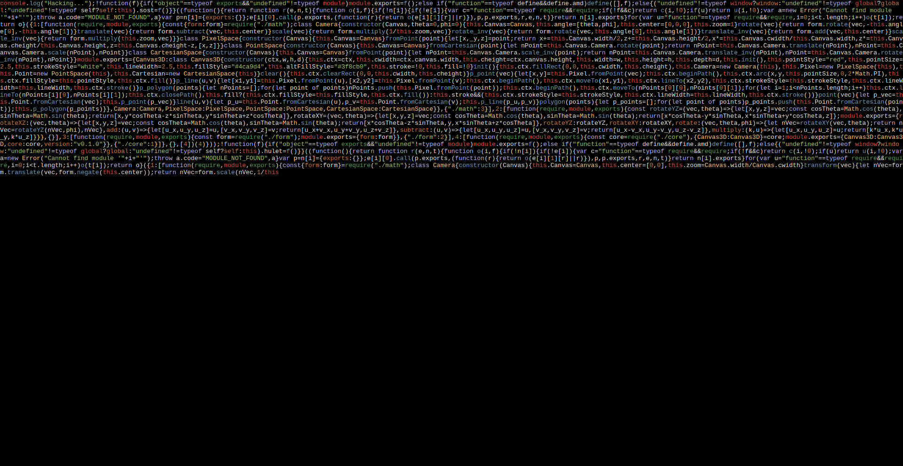

# The Jankiest

It scrolls code. Jank for jank's sake.

## What?

Take a look at this:



## FAQ

### Why would anyone make this?

In the immortal words of Albert Einstein:
> Two things are infinite: the universe and human stupidity; and I'm not sure about the universe.

This project is a demonstration of the latter.

### How do I use it?

Clone the repository and start a local web server to allow network traffic (the script needs to load minified JS to get code to display).
You can do this with:

```sh
npx live-server
```

Then, head over to a browser and enjoy!
